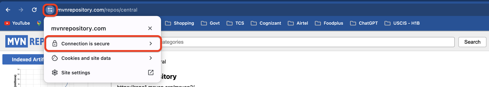
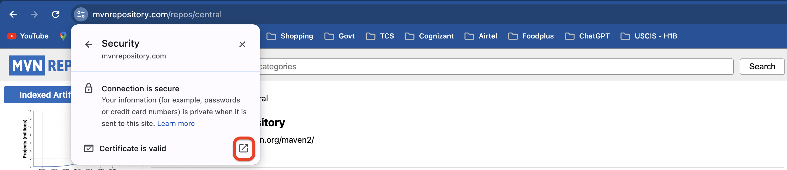
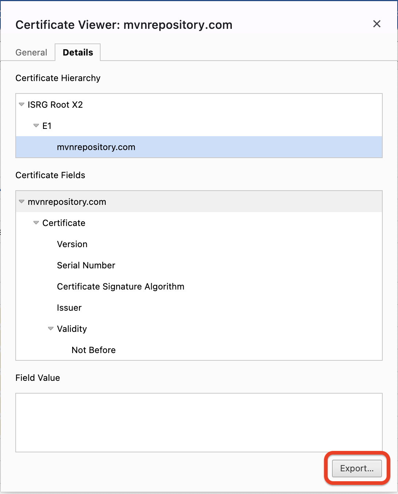
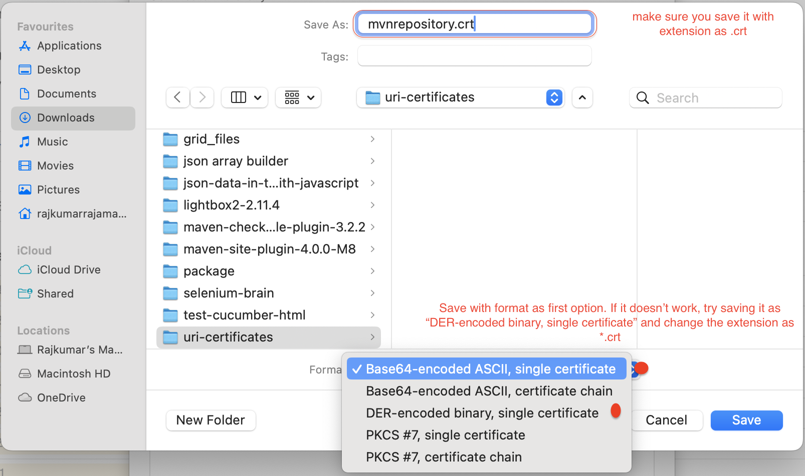

### In case of the below type of error with intellij, please try to follow these steps to resolve it

> [!ISSUE] com.fasterxml.jackson.core.jackson-databind:jar:2.14.3 failed to transfer from https://repo.maven.apache.org/maven2 during a previous attempt.
> This failure was cached in the local repository and resolution is not reattempted until the update interval of central has elapsed or updates are forced.
> Original error: Could not transfer artifact com.fasterxml.jackson.core:jackson-databind:jar:2.14.3 from/to central (https://repo.maven.apache.org/maven2):
> PKIX path building failed: sun.security.provider.certpath.SunCertPathBuilderException: unable to find valid certification path to requested target
> 
> Try to run Maven import with -U flag (force update snapshot)

#### Root Cause

The error “pkix path building failed” generally happens while working with Java client applications and HTTPS web services or APIs.
This is generally accompanied by another error message saying - “unable to find valid certification path to requested target''. The error is thrown by sun. security.

#### Further Cause of error

The reason, we get above error is that JDK is bundled with a lot of trusted Certificate Authority(CA) certificates into a file called ‘cacerts’ but this file has no clue of our self-signed certificate.
In other words, the cacerts file doesn’t have our self-signed certificate imported and thus doesn’t treat it as a trusted entity and hence it gives the above error.

#### How to fix the above error

To fix the above error, all we need is to import the self-signed certificate into the cacerts file.

* Download the certificate from the desired URI. For example, to import certificates of maven dependency, open the url and follow the below images,

  

  

  
  
  <br>


* Once you have located the cacerts file, now we need to import certificates
* To install/add certificates to java cacerts file, we need to Java's keytool which is located under java's /bin folder
* Open ```cmd``` or ```powershell``` for windows or ```terminal``` for mac
* Then locate the terminal to java's bin directory where keytool.exe is located using below command

* 

    ```shell
      #windows
      cd c:\Program Files\Java\jdk_21\bin
    ```
* Then in the command window, run below command to install certificate
```shell
##To generate certificate from keystore(.jks file) ####
keytool -export -keystore keystore.jks -alias selfsigned -file selfsigned.crt

```


#### Reference URL
* https://www.littlebigextra.com/how-to-fix-pkix-path-building-failed-sun-security-provider-certpath-suncertpathbuilderexception/
* 