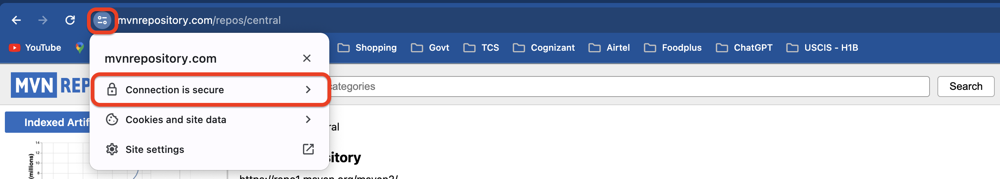
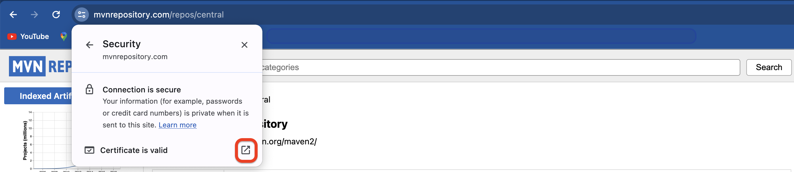
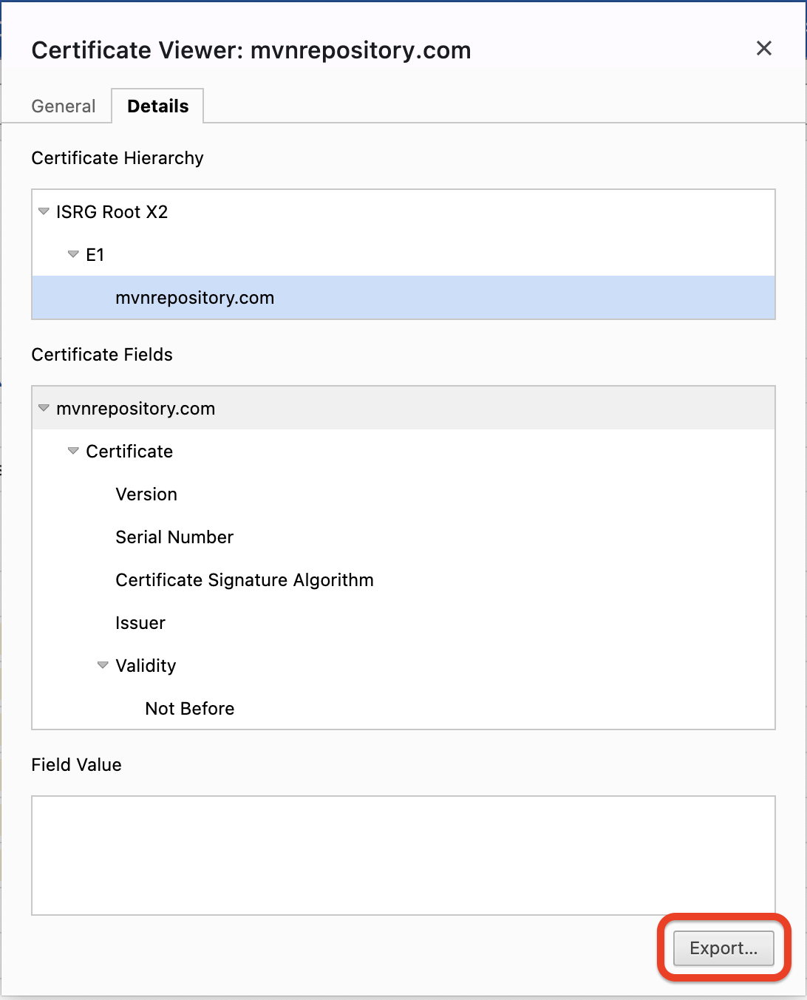
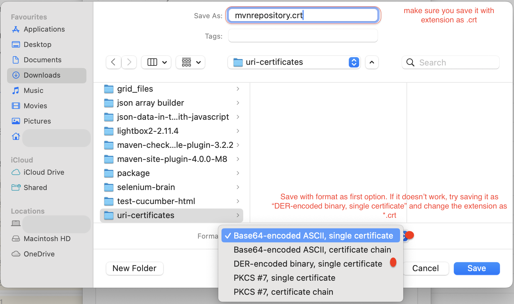
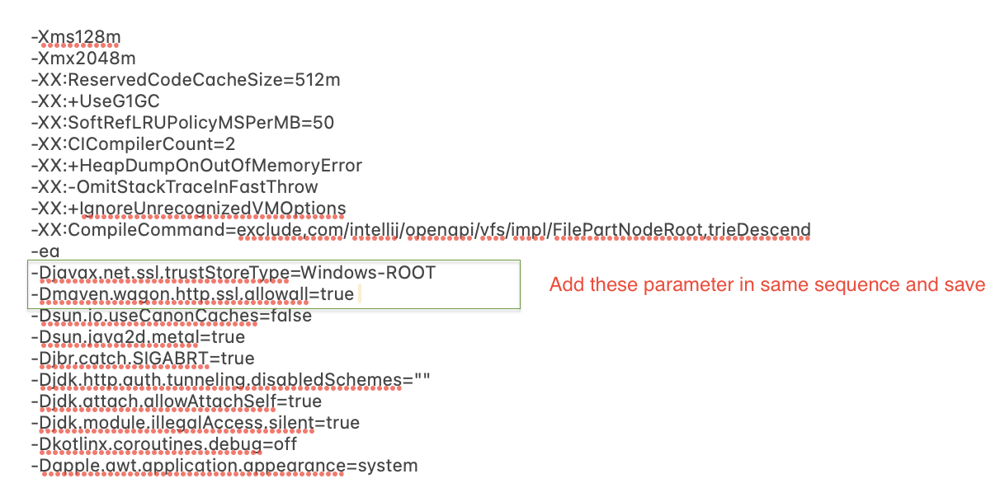

## Challenge 1: In case of the below type of error with intellij, please try to follow these steps to resolve it

> [!ISSUE] com.fasterxml.jackson.core.jackson-databind:jar:2.14.3 failed to transfer from https://repo.maven.apache.org/maven2 during a previous attempt.
> This failure was cached in the local repository and resolution is not reattempted until the update interval of central has elapsed or updates are forced.
> Original error: Could not transfer artifact com.fasterxml.jackson.core:jackson-databind:jar:2.14.3 from/to central (https://repo.maven.apache.org/maven2):
> PKIX path building failed: sun.security.provider.certpath.SunCertPathBuilderException: unable to find valid certification path to requested target
> 
> Try to run Maven import with -U flag (force update snapshot)

#### Root Cause

The error “pkix path building failed” generally happens while working with Java client applications and HTTPS web services or APIs.
This is generally accompanied by another error message saying - “unable to find valid certification path to requested target''. The error is thrown by sun. security.

#### Further Cause of error

The reason, we get the above error is that JDK is bundled with a lot of trusted Certificate Authority (CA) certificates into a file called ‘cacerts’ but this file has no clue of our self-signed certificate.
In other words, the cacerts file doesn’t have our self-signed certificate imported and thus doesn’t treat it as a trusted entity and hence it gives the above error.

#### How to fix the above error

To fix the above error, all we need is to import the self-signed certificate into the cacerts file.

> [!IMPORTANT]
> Ensure you have appropriate combination of maven dependencies in your POM.XML

* First, download the certificate from the desired URI. For example, to import certificates of maven dependency, open the url and follow the below images,

  

  

  
  
  <br>


* Ensure the file "cacerts" is available in the below location
  ```shell
  #Windows
  %JAVA_HOME%\lib\security\cacerts
  
  #Mac
  /Library/Java/JavaVirtualMachines/jdk-17.jdk/Contents/Home/lib/security/cacerts
  ```
* Once you have located the cacerts file, now we need to import certificates
* To install/add certificates to java cacerts file, we need Java's keytool which is located under java's /bin folder
* Open ```cmd``` or ```powershell``` for windows or ```terminal``` for mac
* Then locate the terminal to java's bin directory where keytool.exe is located using below command

  ```shell
    #windows
    cd c:\Program Files\Java\jdk_21\bin
    
    #Mac
    cd /Library/Java/JavaVirtualMachines/jdk-17.jdk/Contents/Home/bin
  ```
* Then in the command window, run below command to install certificate
  ```shell
  ##To import/add certificate into cacerts
  keytool -trustcacerts -keystore "{absolute-path-of-cacerts-directory}" -storepass changeit -importcert -alias "{alias-certificate-name}"  -file "{.cer-file-location}"
  
  # Note
  # {alias-certificate-name} could be any name as you wish. This is generally given to make uniqueness of certificates while adding different certificates of different versions of same dependency - to avoid duplicate certificate key
  # {.cer-file-location} could be path of the downloaded .crt file
  
  # For Windows
  # {absolute-path-of-cacerts-directory} could be "$env:%JAVA_HOME%\lib\security\cacerts"
  
  # For Mac
  # {absolute-path-of-cacerts-directory} could be "/Library/Java/JavaVirtualMachines/jdk-17.jdk/Contents/Home/lib/security/cacerts"
  ```

* Having successfully imported the certificate, run below terminal command and run your maven project

  ```shell
  # For Windows
  mvn -D javax.net.ssl.trustStoreType=Windows-ROOT -D maven.wagon.https.ssl.insecure=true -D maven.wagon.http.ssl.allowall=true clean test
  
  # For Mac
  mvn -D javax.net.ssl.trustStoreType=KeychainStore -D maven.wagon.https.ssl.insecure=true -D maven.wagon.http.ssl.allowall=true clean test
  ```

* If the issue still persists, then try below

  ```shell
  # in case of eclipse IDE, along with above mvn command, add another parameter and try running it 
  mvn 
  -D javax.net.ssl.trustStoreType=Windows-ROOT 
  -D maven.wagon.https.ssl.insecure=true 
  -D maven.wagon.http.ssl.allowall=true 
  -D org.eclipse.ecf.provider.filetransfer.excludeContributors=org.eclipse.ecf.provider.filetransfer.httpclientjava clean test
  
  # in case of IntelliJ Idea IDE, open the file vmoptions in any editor and add below two parameters
  # For Windows - <IntelliJIdea-installation-directory>/bin/idea64.exe.vmoptions
  # For Mac - /Users/<useName>/Applications/IntelliJ IDEA Community Edition.app/Contents/bin/idea.vmoptions
  ```
  ###### idea.vmoptions file

  

#### Reference URL
* https://stackoverflow.com/questions/21076179/pkix-path-building-failed-and-unable-to-find-valid-certification-path-to-requ
* https://www.littlebigextra.com/how-to-fix-pkix-path-building-failed-sun-security-provider-certpath-suncertpathbuilderexception/
* https://www.littlebigextra.com/how-to-enable-communication-over-https-between-2-spring-boot-applications-using-self-signed-certificate/


## Challenge 2: Unable to add files with lengthy file name into git Commit

When some files are not added into git commit due to its lengthy file name, then run below command to allow lengthy files path as well into git commit

  ```shell
  $ git config core.longpaths true
  ```